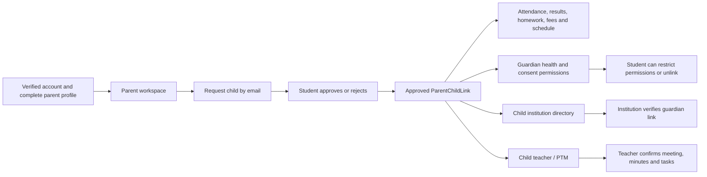

# Parent flow: implementation and acceptance status

Updated: 2026-10-10. Scope: frontend D:/Career-Z and backend D:/Career-Z-backend, against the English and Urdu master requirements. Changes are local; deployment has not been performed.

## Remaining-work acceptance results (2026-10-10, second pass)

Each item below records what was actually executed and observed. "Not verified" means it was not run, because the credential, provider or device it needs does not exist in this environment. Nothing is marked passed without an executed result.

| # | Item | Result | Evidence |
|---|---|---|---|
| 1 | Guardian proof upload/review in a real browser | **Passed, 9/9** | `guardian-proof-browser.cjs` |
| 2a | Multi-account: two children, two guardians, two schools, sponsor, restricted permissions, transfer, unlink | **Passed, 5/5** | `parent-multi-account.test.cjs` |
| 2b | Mobile, keyboard, accessibility tree and language switching | **Passed, 10/10**, after one accessibility fix. Translation provider is stubbed | `parent-ux-browser.cjs`, `parent-ux-mobile.png`, `parent-ux-urdu-mobile.png` |
| 3 | SMTP email | **SMTP accepted** (Gmail `250 OK`) for one test message to the owner's address. Inbox arrival not yet confirmed by the owner | Run log below |
| 3 | Twilio SMS/WhatsApp | **Not verified**. No institution has connected Twilio (0 credentials) | — |
| 3 | Background push | **Not verified**. VAPID keys configured; 0 push subscriptions exist; no subscribed device available | — |
| 4 | BYOK / institution-funded parent AI, real provider | **Not verified**. No platform test key. The 2 AI keys in the live database belong to users and were deliberately not used. Consent, school isolation and usage recording remain covered by the stubbed integration test | `parent-completion.test.cjs` |
| 5 | Real classroom media and PTM video across devices, TURN, observer revocation | **Not verified**. `RTC_TURN_*` is not configured (STUN only); no second device or network. Signalling, observer receive-only and revocation remain covered by socket tests | `parent-classroom.test.cjs` |
| 6 | Payment gateway checkout, webhook, settlement and refund | **Credentials verified only**: Paddle sandbox API 200 with webhook `…/api/webhooks/paddle` active; NOWPayments API and key 200. No checkout, settlement or refund was performed (needs a person to pay in the sandbox). JazzCash sandbox still returns 199 (earlier finding) | Run log below |
| 7 | Production configuration | **Partial, with findings F2 and F3**. Live database is a 3-member Atlas replica set (`atlas-47ihwt-shard-0`), so transactions are supported. Live backend responds (health 200), but runs older code than this workspace (`/api/auth/social/providers` → 401 on live). See F2 and F3 | Run log below |

### Item 1: guardian proof browser acceptance (9/9)

Setup: the real backend app (`src/app`: same 6 MB JSON limit, account gate and RBAC as production), a disposable MongoDB replica set, headless Chrome, the actual `FamilyConnections` and `GuardianProof` React components, and real files on disk (1.4 MB JPG, 1.45 MB PDF).

1. Parent uploads both documents from My Children. The request (3.71 MB) fits the 4.5 MB serverless limit. Files are stored encrypted with status pending.
2. A 1.6 MB file is rejected, and so is a file whose bytes do not match its declared type. Neither replaces the pending proof.
3. These accounts are refused (403/401): another parent, the child, a teacher, school staff without `parents:manage`, an unrelated school's owner, and an anonymous request. The owner and a `parents:manage` reviewer are allowed.
4. The institution downloads both files in the browser. The downloads are byte-identical to the uploads.
5. Approve stays disabled until review notes are written and the admission-record match is ticked. The API also refuses `admissionMatched:false`. Approval sets this school's verification. A replay returns 409.
6. The parent sees "approved" and the school's note.
7. Resubmission resets verification. The reviewer rejects with a reason, and the parent sees "rejected" and the reason.
8. A revoked link blocks both parent and school. Proof uploaded before a renewed link cannot verify the renewed link (409).
9. After the child is withdrawn, the former school can no longer open the documents.

### Item 2: multi-account acceptance

`parent-multi-account.test.cjs` runs over real HTTP with 9 accounts, 2 schools and 4 links, and passed 5/5:

- **Linking:** a link is created only when the child approves. A requester cannot approve their own request. Mother sees both children, Father only ChildOne, Sponsor only ChildTwo, and ChildOne lists two guardians.
- **Data isolation:** each child's results include only that child's school data. Cross-child access returns 403. School directories list only their own children's guardians, and owner A is refused school B's directory.
- **Sponsor and permissions:**
  - The sponsor can view fees but not health. Health cannot be granted to a sponsor (422).
  - A guardian cannot change their own permissions. A string `"false"` is rejected (422).
  - The child restricting Father (health and payment) does not affect Mother. Father's restricted wallet payment is refused and his balance is unchanged.
- **Transfer A→B:** A's directory drops the guardian and B's adds him. The parent's child shows School B only. Feedback to the former school is refused.
- **Unlink:**
  - Unlinking by the child or the guardian removes access immediately, and a replay returns 409. Another guardian cannot remove a link (403).
  - Unlinking one child keeps the other.
  - Re-requesting a link does not restore access without approval.

`parent-ux-browser.cjs` logs in through the real Login page with a parent that has two children, and passed 10/10:

- **Mobile:** no horizontal overflow at 390px on Dashboard, My Children, Wallet / Payment Records and My Profile.
- **Keyboard:** 40 Tab stops reach the navigation. Every stop has an accessible name and a visible focus indicator. Enter on My Children opens it.
- **Accessibility tree:** every interactive control has a name, and 8 headings are exposed. This is Chrome's accessibility tree, not a run with an actual screen reader (NVDA/TalkBack); that still needs a person on the target device.
- **Language:** Urdu sets `lang=ur` and `dir=rtl`, applies translated text without overflow at 390px, and English restores LTR. The translation provider is **stubbed** because `GOOGLE_TRANSLATE_API_KEY` is not configured, so real translation quality was not tested.

### Findings and fixes from this pass

- **F1 (fixed): guardian proof upload would fail in production.**
  - Problem: both files travel base64-encoded in one JSON request. Two 2 MB files become ~5.5 MB, above Vercel's 4.5 MB serverless request limit, so production would have answered 413 even though local tests (6 MB limit, tiny fixtures) passed.
  - Fix: the per-file limit is now 1.5 MB in both `guardianProof.controller.js` and `GuardianProof.jsx` (2 × 1.5 MB ≈ 4.1 MB). The browser test asserts the request stays under 4.5 MB.
- **F1b (fixed): dashboard search had no accessible name.** The header search input relied only on its placeholder, so the accessibility tree reported it as an unnamed textbox. It now has `aria-label="Search institutions, courses and jobs"` (`DashboardHeader.jsx`).
- **F2 (open): no durable scheduler in production.**
  - The family automation endpoint `GET /api/internal/family-automation` requires `CRON_SECRET`, which is not set.
  - The backend has no `vercel.json` cron and no long-running worker on Vercel serverless, so absence warnings, PTM reminders and expiry will not run automatically after deployment.
  - Needed: set `CRON_SECRET` and add a scheduler (a Vercel Cron entry or an external cron) that calls the endpoint with `Authorization: Bearer <CRON_SECRET>`.
- **F3 (open): live deployment is behind this workspace.** The live backend does not have the latest routes. Parent, verification and social-login changes are not live until deployed.

### Run log (2026-10-10)

- **SMTP:** `sendEmail` to the owner's address → `accepted:[owner]`, `250 2.0.0 OK … gsmtp`, not simulated. Inbox receipt pending owner confirmation.
- **Paddle (sandbox):** `GET /notification-settings` → 200, destination `https://career-z-backend.vercel.app/api/webhooks/paddle` active.
- **NOWPayments:** `GET /status` → 200 `{"message":"OK"}`; `GET /currencies` with key → 200.
- **Live database:** `hello` → setName `atlas-47ihwt-shard-0`, 3 hosts.
- **Live backend:** `/api/health` 200; `/api/auth/social/providers` → 401 (route not deployed).
- **Configuration presence:**
  - Twilio credentials 0, push subscriptions 0.
  - `RTC_TURN_*` unset, `GOOGLE_TRANSLATE_API_KEY` unset, `CRON_SECRET` unset.
  - Platform AI keys unset.
- **Regression after these changes:** parent-lifecycle 13/13, parent-wallet 4/4, parent-classroom 3/3, parent-completion 14/14, parent-multi-account 5/5, parent-browser 24/24, guardian-proof-browser 9/9, parent-ux-browser 10/10; backend full suite 281/281; production build passed.

### What is needed to close the "not verified" items

| Item | Needed |
|---|---|
| SMS/WhatsApp | An institution's Twilio Account SID, Auth Token and sender numbers, connected through the institution comms settings, plus a test phone. |
| Push | Open the deployed site on a phone or desktop browser, enable notifications, then trigger a parent alert. |
| AI | A test provider key (BYOK on a test parent, or an institution key with parent AI enabled). |
| Video | TURN credentials (`RTC_TURN_URLS`, `RTC_TURN_USERNAME`/`RTC_TURN_CREDENTIAL` or shared secret), plus two or three devices on different networks (teacher, student, guardian observer). |
| Payments | One sandbox checkout completed by a person on the deployed site; then confirm the webhook, the settlement record and a refund. |
| Production | Deploy, set `CRON_SECRET` and the scheduler (F2), then rerun this list against the live URLs. |
| Screen reader | A short NVDA (Windows) and TalkBack (Android) pass by a person. |

## Current implementation

### Additional guardian identity verification

Parent My Children now accepts two private documents per linked school: guardian identity/CNIC and child B-Form/birth certificate/legal guardianship proof (JPG/PNG/PDF, maximum 1.5 MB each — lowered from 2 MB on 2026-10-10, see acceptance results below). Files are encrypted at rest and available only to the linked parent and that school's owner or staff with parents:manage permission, while the approved link and current school membership remain valid. Teachers and unrelated schools cannot download them.

Institution Parent Management supports private download, review notes, admission-record match confirmation, approval/rejection and review history. The existing Verify endpoint now refuses approval without an approved document review. Resubmission resets that school's verified status; proof from a previous revoked connection cannot verify a renewed connection. This is a human identity/relationship review, not automatic government-record verification. Student-approved academic access remains consent-based; the verified badge records the additional school review.

Verification after this addition: completion suite **14/14 passed**, relationship workflow suite **8/8 passed**, production build passed. The new integration test exercises private document submission, unrelated parent/staff refusal, missing proof refusal, admission-match requirement, approval, replay refusal and resubmission revocation. The previously recorded browser checks predate this additional document UI; the file upload/review UI has not received a new full browser walkthrough.

The original repair list has been implemented locally. The historical findings and 55-area table below describe the BEFORE state, not outstanding work. Live service acceptance is separate and remains unverified as listed below.

- Connections: parent/student invitations, recipient approval/rejection, retry, immutable lifecycle history, student guardian permissions, sponsor restrictions, unlink and current primary/secondary-school discovery. Each school verifies its own guardian relationship.
- Academics: child details, monthly attendance and PDF, safe exam schedule without papers/answers, homework status and teacher feedback, session/school-filtered marks, actual class rank, strong/weak subjects, timetable, achievements, certificates/student ID and own library loans. Actual branded report-card PDF was downloaded in the browser.
- Communication: child-derived teacher and school contacts in both directions, authorized guardian groups, attachment-only messages, blocking, configurable prohibited terms and complaint-bound selected evidence. Unrelated or revoked relationships cannot expose private conversations. Parent private messages do not generate ordinary email/push alerts.
- Consent and school operations: current-school request inbox, typed-name signature, grant/deny/history/expiry/cancellation, parent directory, school information/publications and school feedback. Teacher progress/behavior notes include course and class-timetable rosters. Parent-management and finance staff permissions are enforced separately.
- PTM: actual course/class teachers, student invitation to guardians, teacher availability, future booking, atomic overlapping-slot reservations, cancellation release, physical location or unique HTTPS video room, minutes/tasks, no-show/escalation, expiry and durable reminders.
- Finance: payer-safe fees, actual wallet balance and ledger, transactional partial payments, minimum partial policy, verified receipts, institution/platform balance conservation, idempotent retry, concurrency and original-payer refunds. No internal commission fields are returned to parents. Transactions require a MongoDB replica set.
- Cafeteria: school menus/allergens, owner-authorized staff, stock, parent wallet purchase, child pickup code, collection, cancellation/restocking and institution refund. Real temporary wallet balances were exercised through browser and integration tests.
- Classroom: institution opt-in plus guardian permission and current child enrollment; parent receives only observer media. Parent cannot become student attendance/engagement or send media/chat/poll votes. Link, permission and school withdrawal revoke observation.
- Automation: deduplicated absence, low marks, homework/results/fee notices, PTM reminders/expiry and school-configured persistent absence warning. Existing worker integration plus protected family-automation endpoint support scheduling. Warnings do not automatically suspend or withdraw a child.
- AI/privacy/admin: BYOK or explicitly authorized institution-funded AI, per-request sharing consent and institution-only prompt records; encrypted/masked parent-only bank details/private notes; parent admin statistics, AI usage and complaint evidence. Reputation disputes must reference the requesting parent's own activity at that school.

## Final verification

- Final combined integration run: **105/105 passed** (74 existing shared integration tests + 31 parent-specific tests), zero failures.
- Final completion regression file after the last permission fixes: **13/13 passed**, including two additional finance/dispute authorization tests. Total distinct tests in these runs: **107**.
- Browser: **24 checks passed**, covering real protected temporary APIs, parent/student/teacher/institution password login and logout, dashboard navigation, consent, roster, academics, 390px layout, private details, cafeteria, wallet checkout and PDF download.
- Production build passed: 1684 modules; SEO generator produced 28 public pages and sitemap. Existing FaceMesh/chunk warnings remain.
- Separate group and notification integration suites previously passed: 6 group tests and 4 notification tests. They are not counted in the 107 above.

Tests use disposable MongoMemoryServer/replica-set databases and synthetic accounts; email/AI delivery is mocked. Browser realtime provider is omitted to avoid connecting test accounts to the real local server; guardian sockets are exercised separately against an actual isolated Socket.IO server.

Evidence: parent-lifecycle.test.cjs, parent-wallet.test.cjs, parent-classroom.test.cjs, parent-completion.test.cjs and parent-browser.cjs. Browser artifact: parent-performance-mobile.png. PDF: parent-downloads/report-card.pdf.

## Production acceptance still required

These checks require configured providers/devices and have NOT been claimed complete:

1. Actual SMTP email, Twilio SMS/WhatsApp and background push on subscribed devices.
2. Actual configured AI-provider response and billing; tests verify policy and prompt privacy using a stub.
3. Real teacher/student/guardian video and audio across devices/networks, including TURN and external PTM rooms; transport GPS hardware where used.
4. External payment-gateway sandbox settlement/refund and provider webhooks; wallet flows were tested with real temporary database balances.
5. Deployment configuration, durable scheduler invocation, production replica-set transactions and translated-language/screen-reader acceptance on target devices.

Do not rerun apply/install/finish staging scripts blindly: many are one-time implementation patches. Run the regression tests for validation.

## Historical baseline (before the fixes)

The following master mapping, defects and coverage table are retained for traceability. Labels such as Missing/Partial refer to the initial audit snapshot and are superseded by the implementation and verification above.

## Master coverage

The master repeats requirements in English and Urdu. Reviewed sources include universal account/role rules (26–31), teacher communication/reputation (9.13/9.19), student profile/connection (10.3/10.17), all 17 Part 11 parent sections, parent linking/classroom/progress (15A.10/15B.13/15C.15), institution SIS/communications/helpdesk/events/staff access (15D), administration/security/automation (16A/16D/16E/17E), financial confidentiality (fee commission must remain private), universal messaging, detailed student/teacher/institution dashboards, and the complete Urdu parent dashboard at master lines 29763–30171.

Source context is preserved in `parent-master-extract-2026-10-10.txt`. Repeated requirements are consolidated below; a page label alone does not count as complete implementation.

## Original relationship flow at audit time

The diagram describes the intended existing backbone. Important broken connections are listed below. Parent links do not automatically enroll children in a school or course. School membership and course enrollment remain separate records. Parent access comes from an approved child link, not from merely entering a child's email or receiving a parent role.

1. **Parent → student:** request by student email; student must approve. Multiple children and multiple guardians are represented by separate links. Health/consent are guardian-only; sponsor is narrower. Parent can unlink.
2. **Student → parent:** receives pending requests and can approve/reject; can narrow fee/health/consent permissions and unlink. The connected-guardian listing is currently broken, and the master-specified student-initiated request using parent mobile is absent.
3. **Institution → parent:** directory derives approved links from primary-institution student profiles; can mark a guardian link verified, receive satisfaction feedback, inspect private engagement score and PTM escalation. Sending messages is currently broken for ordinary parents without their own separate institution membership.
4. **Parent → institution:** school information, satisfaction rating, helpdesk, events, publications and fee reporting are present. Several views use only the first child's primary school. Secondary-school membership is not consistently applied.
5. **Parent → teacher:** actual timetable teachers are offered for PTM; request → teacher confirmation/decline → meeting → minutes/tasks. Teacher communication screen exists, but contact permission is broken. Independent tutors are not included in the timetable-only PTM teacher resolver.
6. **Teacher → parent:** approved guardians appear among taught-course contacts; absent/result notifications fan out to approved links. Sending a direct message is rejected by the separate authorization resolver. Teachers can respond to PTMs, record summaries/action items and mark a no-show.

## Confirmed defects and first repair priorities

| ID | Priority | Finding and evidence | Repair acceptance condition |
|---|---|---|---|
| P03 | Critical | `parent.controller.js:childExams` returns the full published Exam object, including future paper questions and `correctOption`. Isolated probe returned both paper and answer key. A schedule view must not expose assessment answers. | Schedule returns an explicit safe projection; future paper/answer keys never returned. Test before/after opening time, dropped enrollment and unrelated child. |
| P01 | High | `messageAccess.js:communicationContacts` lists the child's parent for the teacher, but `canCommunicate` does not traverse parent→child→teacher/institution. Probe: teacher listed parent, both teacher↔parent sends disallowed, parent→owner disallowed. | Shared contact resolution and authorization agree; correct child's teachers and authorized school contacts work in both directions; unrelated teachers, other parents and revoked links remain blocked. |
| P02 | High | Student UI calls `/parents/link-requests`; `myLinkRequests` filters `parent:req.user._id`. An approved guardian exists but student receives zero rows. | Student sees links where they are the student, with populated guardian identity; permissions/unlink controls remain usable after approval. |
| P06 | High | Parent routes have `protect`, but `requestLink` has no parent-role check. Probe created a guardian request from a student-only account. Account gate alone verifies an available role, not authorization for this action. | Only a permitted parent initiates parent-side requests; no self-links, role misuse, unsupported relationships or inactive targets. |
| P05 | High | Institution parent directory and verification use `StudentProfile.primaryInstitution`; active secondary membership was present but secondary-school directory returned zero parents. | All active relevant memberships resolve the correct child and school; revoked/withdrawn memberships remove ongoing access. |
| S01 | High | `payment.controller.js:assertCanPayFee` checks an approved link but not `permissions.payFees`, unlike manual fee reporting. | Every gateway checkout follows the same fee-payment permission rule before calling the external provider. |
| S02 | High | Parent payment-record table explicitly displays platform commission/net amount. Parent fee API returns unsanitized Fee records. Master line 11866 requires commission confidentiality. | Parent-facing API/UI/receipt use payer-safe fields; platform commission stays internal. |
| S03 | Medium | `institutionVerified` is one boolean on a global parent-child link, not per institution. Current primary-school-only checks mask this limitation. | Verification belongs to a specific school and cannot be overwritten or misrepresented by another school. |
| S04 | Medium | Rejected/pending requests are not shown in ParentPanel (loads approved children only). Retry gets duplicate-link error; initial request and approval handlers do not notify counterpart. | Parent sees pending/rejected status, cancellation/resend policy and both-party notifications. |
| S05 | Medium | Permissions use `Boolean(value)`: a string `"false"` becomes true. Sponsor defaults are corrected on approval, and medical APIs correctly reject sponsors; input validation should still be strict. | Boolean-only inputs, meaningful audit history, role/custody limits applied consistently. |
| S06 | Medium | PTM history/actions are tied to parent/teacher IDs; revalidation after guardian unlink/teacher change is not consistently present. | Explicit policy for retained history versus ongoing booking/actions/contact after relationship revocation. |

P01–P07 are dynamic audit probes. S01–S06 are code findings, not reproduced live-provider failures. P04 and P07 are positive controls: another child's attendance returned 403, own attendance included no classmates, and unlink removed attendance access immediately.

## Original requirement-by-requirement coverage (before implementation)

“Present” means code exists; “Partial” means missing parts or an unresolved integration; “Missing” means no implementation located in the inspected parent flow. Existing test coverage does not automatically prove the corresponding browser page.

| # | Master requirement | State | Existing implementation and remaining work |
|---|---|---|---|
| 1 | One account, parent role, document verification, profile completion | Present | Shared auth/account gate, parent verification requirements and role workspace. Parent-specific successful onboarding still needs browser verification. |
| 2 | Dedicated parent dashboard | Present | ParentSummary + `/parents/me/dashboard`, real child cards, today's attendance/exams/fees/messages/notifications. |
| 3 | Multiple children and multiple guardians | Partial | Unique parent/student pair supports both; selectors exist on many pages, but school information chooses first child. Test two children at different schools and two guardians. |
| 4 | Parent initiates approved linking | Partial | Email request and student approval present; role guard, request notifications/status/retry need repair. |
| 5 | Student enters parent mobile, parent approves | Missing | Master 11.3 reverse invitation flow is absent; contact number in profile is not a consent/link request. |
| 6 | Student guardian list, permissions and revoke | Broken integration | Permission/unlink endpoints exist, connected list uses wrong side of link. |
| 7 | Guardian, father, mother, sponsor, hostel warden | Partial | First four modeled; hostel warden is an operational staff role, not a parent-link relationship. Determine limited warden access explicitly. |
| 8 | Child name/photo/age/class/school/roll/class-teacher/contact | Partial | Dashboard returns most; My Children table only name/email/relationship/access; contact and full details are not rendered there. |
| 9 | Daily present/absent/late/half-day | Partial | Attendance model supports present/absent/late/excused; half-day absent. Parent reads only their child's sheet entries. |
| 10 | Monthly attendance totals, chart and PDF | Missing in parent view | Raw attendance table exists; no month selector, attendance graph or parent attendance PDF action. |
| 11 | Subject marks/grades/term/session | Partial | Result model/read/table present; parent table does not expose all session/institution context. |
| 12 | Rank, strong/weak areas, graph, report-card PDF | Missing in parent view | ParentPerformance is a table with average and attendance; student transcript/report tools are not wired into this parent view. |
| 13 | Teacher homework → student submission → parent sees status/marks | Present backbone | `childHomework` merges published enrolled assignments with submissions; pending/overdue rows included. UI reduces statuses to generic tags. |
| 14 | Homework description and teacher feedback | Partial | Teacher feedback/submission fields exist, parent table displays only title/due/status/marks. Assignment query excludes description. |
| 15 | Exam dates/time/venue/instructions | Partial, unsafe API | Display exists; full paper leak P03 must be fixed; dropped-course filter and exam duration/close time display need attention. |
| 16 | Weekly timetable/teacher/room/online link | Partial | Primary class-section entries displayed; no child multi-school timetable aggregation or explicit online meeting-link field in parent table. |
| 17 | Child academic and behavioral overview | Partial | Overall score and present percentage; behavior notes, teacher improvement suggestions/rank absent. “This term” attendance label currently uses all returned records. |
| 18 | Institution directory and guardian verification | Partial | Owner/staff directory+verify present; secondary school missing; per-school verification not modeled. |
| 19 | School information/contact/logo/news/calendar | Partial | Description/type/location/website + publications/tour; first school only, no complete school contact/branding/calendar block. Events separate. |
| 20 | Parent school satisfaction rating | Present | Rating endpoint requires linked child primary school, upserts one feedback; secondary membership eligibility missing. |
| 21 | Teacher reputation feedback | Partial | Verified linked-child enrollment rating API/shared rating widget exist; clear parent teacher-selection/rating journey needs browser verification and dropped-enrollment filtering. |
| 22 | Fee invoices/paid/unpaid/due date per school | Partial | Actual Fee records per child, schedules and payment statuses exist; parent table omits institution/billing grouping; dashboard total-minus-paid misstates partially paid balances. |
| 23 | Manual bank/mobile/cash proof → school verification | Present backbone | Shared PayFeeButton reports proof; institution verifies/rejects; tests confirm balances change only after verification and guardian pay permission is checked. |
| 24 | Real card/mobile gateway checkout | Partial | Shared Paddle/JazzCash/Stripe checkout buttons present; configuration and real payment verification not performed in this audit; gateway permission inconsistency S01. |
| 25 | Wallet balance and actual parent wallet payments | Partial | Universal wallet exists elsewhere; parent Wallet/Payment Records tab only lists child paid fees, not balance/ledger or wallet fee debit. |
| 26 | Receipt PDF, partial payments, refunds | Partial | Verified receipt identifiers/QR verification and financial lifecycle exist; parent UI shows IDs rather than PDF download. Payment records omit partially paid transactions. |
| 27 | Parent ↔ child's teacher chat | Broken integration | Screens/contact entries exist; actual relationship authorizer rejects P01. Parent button does not preselect teacher. |
| 28 | Parent ↔ principal/accounts/institution chat | Broken integration | Owner/staff messaging exists generically; child-derived school contacts not resolved for ordinary parent. Staff-specific permission scope needs review. |
| 29 | Parent groups and authorized parent↔parent chat | Missing | Inspected message routes are direct conversations; no institution-created parent group/membership flow located. |
| 30 | Chat attachments/history/read/block controls | Partial | Shared direct messaging has HTTPS attachment metadata/history/read and block; parent eligibility prevents actual flow. Attachment-only send still requires text. |
| 31 | Complaint-only chat access, abuse filtering/evidence | Partial/unverified | Generic complaint center present; parent-message routes do not implement group moderation/profanity workflow or complaint-bound evidence export. Detailed master forbids routine private-chat alerts while current send creates notification/email: reconcile policy. |
| 32 | PTM teacher selection/request/confirm/decline/cancel | Present backbone | Timetable-scoped teacher resolver, both party endpoints and UI, teacher replies and notifications. Independent teachers not included. |
| 33 | PTM recurring availability and booking | Present with gaps | Recurring schedules/occurrences/booked dates implemented; concurrency protection and overlapping ad-hoc dates require dedicated tests. |
| 34 | PTM automatic video room/link + physical meeting | Partial | Teacher provides meeting link/location; no automatic built-in video room in PTM controller. Confirmation can accept empty link/location. |
| 35 | PTM timed reminder and student notifies parent | Missing/partial | Creation/response notifications exist; no durable timed reminder scheduler located; student PTM notification action absent. |
| 36 | Meeting notes, action items, no-shows and escalation | Present backbone | Minutes/tasks and three events in 90 days escalate to school; repeated parent cancellation counts too. No-response/background expiry not implemented. |
| 37 | Guardian approval for minor independent tutoring | Present backbone | TeacherStudentLink minor consent gates and parent approval panel; existing relationship tests pass. Missing DOB policy/parent relationship verification needs fuller acceptance review. |
| 38 | Attendance/result/exam/fee/message school alerts | Partial | Absence/result/exam and legacy fee fan-out present; new institution-fee verification primarily notifies student. New homework publishing notifies students, not all linked guardians. |
| 39 | Repeated absence, low marks, behavior and dropout warnings | Missing automation | One-off absence/result alerts do not implement thresholds, behavioral records or dropout policy. |
| 40 | Email, browser push, SMS and optional WhatsApp | Partial | In-app/socket/web-push service and optional email code exist. Actual SMTP/VAPID/browser subscription delivery not verified; no SMS/WhatsApp implementation located in parent communication flow. |
| 41 | Institute emergency announcements to linked parents | Present backbone | Group/audience notification and events/health/transport alerts; real delivery and fine-grained sender staff permissions need acceptance verification. |
| 42 | Transport GPS/driver/pickup/drop/emergency | Present backbone | Journey-scoped child-assigned vehicles and polling map, pickup/drop/emergency handlers; tests establish no unrelated or inactive journey location. Live device GPS not tested. |
| 43 | Health/allergy/blood/emergency/vaccination/incidents | Present backbone | Routed to health.controller rather than old local functions; guardian permissions enforced, sponsors excluded, multi-institution history retained. Health tests pass. |
| 44 | Digital trip/event/photo/medical permission | Partial | Typed-name signed grant/deny stored per parent/student. No school-generated permission-request inbox, institution event linkage, revoke/expiry or school viewing workflow in parent route. |
| 45 | Institution staff access to parent operations | Partial | Parent directory/reputation/verify often owner-or-any-staff, not dedicated guardian/finance/consent capabilities. General notification permissions improved elsewhere do not prove all parent-operation permissions. |
| 46 | Private parent trust/engagement and disputes | Partial | Weighted PTM/consent/notification/fee-resolution/feedback score+disputes present, visible to institution/self. Master says punctual fees/rule compliance/false reports; current score deliberately differs. No immutable audit on every guardian permission change. |
| 47 | Certificates, achievements, awards and photos | Partial | Parent portfolio returns certificate table; achievement/photo/award aggregation and certificate download/view not wired. |
| 48 | School newsletter, magazine and campus view | Partial | First institution's publications/tour rendered; privacy/membership enforcement is inconsistent (query-selected published magazine does not itself establish parent-school relationship). |
| 49 | Cafeteria purchase for child, school library/student ID | Missing parent flow | Master detailed student sections include parent access; no parent menu/journey for cafeteria child purchase, library borrowing access, or child QR student-ID view located. |
| 50 | School events and institution helpdesk | Present backbone | InstitutionCommunity UI, audience filtering, relationship eligibility, ticket assignment/status/history; tests pass. Parent discovery starts from child's primary school. |
| 51 | Optional AI parent assistant | Partial/config-dependent | Parent BYOK summary from linked child attendance/results/fees/exams. Master permits institution-selected provider; current parent assistant does not implement that provider fallback. External AI call and privacy consent not tested. |
| 52 | Classroom observation only when institution permits | Missing | Parent academic summaries exist, but no guardian observation permission/read-only live classroom route found. Never grant student/teacher interaction privileges to parent accidentally. |
| 53 | Parent private identity/bank/notes and account security | Partial | Role verification/private profile shared foundation; private notes/bank-specific parent screen absent. Directory intentionally shares contact data. Detailed sharing/retention policy needs explicit acceptance checks. |
| 54 | Super-admin parent statistics/satisfaction/complaints/fees/AI/support | Partial | Generic usersByRole and platform metrics exist; no consolidated parent-specific activity, satisfaction, engagement and AI-usage dashboard located. |
| 55 | Mobile/accessibility/language and four-role end-to-end acceptance | Unverified | Shared responsive/theming/translation infrastructure exists; parent-specific desktop/mobile browser walkthrough and real communication/video/payment delivery remain. |

